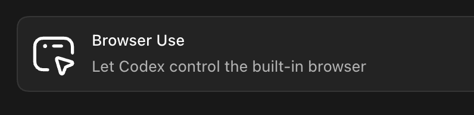
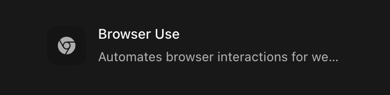
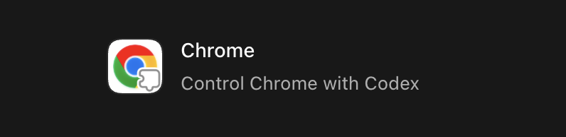
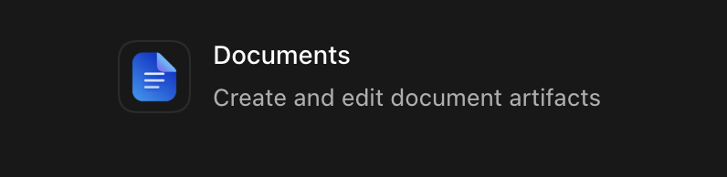
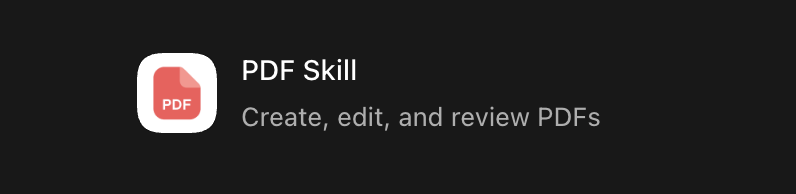

# Codex Job Kit

A job tracker and Codex workflow for finding roles, reviewing fit, preparing applications, and keeping application history out of spreadsheets.

The tracker runs on your machine with SQLite. Codex uses the tracker commands to avoid duplicates, import shortlists, capture manual leads, log submitted applications, and summarize recent search runs.

## Set Up With Codex

After cloning the repo, open it in Codex and send this message. Attach or upload your resume with the same message if you can.

```text
Set up codex-job-kit for my repository based on docs/setup-with-codex.md.
Read SPEC.md and .codex/skills/codex-job-kit-setup/SKILL.md first.
I have attached my resume. If you cannot see it, ask me for it before creating my candidate profile.
```

Codex should:

- install tracker dependencies and run `pnpm lint`, `pnpm build`, and `pnpm smoke-test`
- check whether Codex Browser Use / `browser-use` or Chrome is available and tell you what to enable if both are missing
- ask for your resume or profile source if you did not provide one
- ask for missing preferences as a grouped checklist covering basics, targets, filters, sources, and workflow
- ask whether you want discovery-only, assisted applications, or both
- create private files under `local/`
- configure tracker Settings and private prompts
- propose automations and show the next prompt to start your first workflow

Codex should read [SPEC.md](SPEC.md), [docs/setup-with-codex.md](docs/setup-with-codex.md), and the [setup skill](.codex/skills/codex-job-kit-setup/SKILL.md). Assisted application sessions should also read the [application workflow skill](.codex/skills/job-application-workflow/SKILL.md).

## Recommended Codex Capabilities

Install or enable these in Codex before running the full workflow:

| Capability | Use |
| --- | --- |
|  | Recommended Codex capability for job-board discovery, live listing verification, tracker browser checks, and assisted application forms. |
|  | Optional external Browser Use CLI/upstream skill for non-Codex or CLI agent environments. See [browser-use/browser-use](https://github.com/browser-use/browser-use) and the [Browser Use CLI docs](https://docs.browser-use.com/open-source/browser-use-cli). |
|  | Recommended fallback for signed-in job-board sessions or sites that do not work well in Browser. |
|  | Recommended for editing resume and cover-letter document artifacts. |
|  | Recommended for creating, reviewing, and checking resume or cover-letter PDFs. |
|  | Optional last-resort fallback for OS-level actions when Browser and Chrome are unavailable. |
|  | Optional for mailbox status checks if the user explicitly wants email sync later. The default workflow does not use Gmail. |

Automations are recommended for scheduled shortlist runs and weekly pipeline reviews. If automations are not available, you can run the workflow prompts manually. This repo includes job-search skills that assume Codex Browser Use or Chrome is available.

You do not need GitHub or email plugins for the default workflow. The Codex skills are included in this repo, so you do not need to install them separately:

- [Setup skill](.codex/skills/codex-job-kit-setup/SKILL.md)
- [Application workflow skill](.codex/skills/job-application-workflow/SKILL.md)

Without Codex Browser Use or Chrome, you can still run the tracker and CLI commands, but Codex cannot verify live job pages or assist with application forms.

Your machine also needs Node.js 20 or newer and `pnpm`. The setup request above authorizes Codex to run `pnpm install`, `pnpm lint`, `pnpm build`, and `pnpm smoke-test` inside `job-tracker/`.

## What You Get

- A Next.js job tracker in `job-tracker/`
- SQLite storage for jobs, reviews, applications, documents, and workflow runs
- Codex Browser Use prompts for job discovery and assisted applications
- CLI commands for lookup, import, status updates, cover letters, and run summaries
- Fake sample payloads for testing setup without using personal data
- Codex skills for setup and assisted application workflows

## Quick Start

```bash
cd job-tracker
pnpm install
pnpm smoke-test
pnpm dev
```

Open [http://localhost:3000](http://localhost:3000).

Run checks:

```bash
cd job-tracker
pnpm lint
pnpm build
pnpm smoke-test
```

## Workflows

**Discovery**

1. Codex searches configured sources with Codex Browser Use / `browser-use`, or Chrome fallback when needed.
2. Codex checks duplicates with the tracker.
3. Codex verifies live listings.
4. Codex imports recommended, borderline, and skipped roles.
5. Codex finalizes the run so the tracker can show process summaries and lane performance.

**Assisted applications**

1. Codex starts from tracker roles, job-board results, or company/ATS pages.
2. Codex checks duplicates before filling anything.
3. Codex fills factual answers from your local candidate profile.
4. Codex pauses before final submit and asks for confirmation.
5. Codex logs submitted applications or captures `ready_to_apply` manual leads.

## Useful Commands

```bash
cd job-tracker
pnpm smoke-test
pnpm lookup-job --url https://example.com/job
pnpm lookup-jobs-batch ../examples/shortlists/sample-shortlist.json
pnpm import-shortlist ../examples/shortlists/sample-shortlist.json
pnpm finalize-search-run ../examples/shortlists/sample-run-finalize.json
pnpm lane-performance --limit 7
pnpm capture-lead ../examples/application/manual-lead.json
pnpm log-application ../examples/application/application-outcome.json
pnpm update-job-status ../examples/application/status-update.json
```

Import sample data into the real tracker only when you want fake roles visible in the UI:

```bash
cd job-tracker
pnpm import-shortlist ../examples/shortlists/sample-shortlist.json
```

## Private Files

Keep personal data in ignored local paths:

- `local/resume/`
- `local/candidate-profile.md`
- `local/job-search-preferences.md`
- `local/prompts/daily-shortlist.md`
- `local/prompts/assisted-application.md`
- `job-tracker/data/jobs.db`
- `job-tracker/data/settings.json`
- `job-tracker/storage/`

Do not commit resumes, cover letters, real application history, browser profiles, cookies, passwords, or local settings.

## Automations

Good automation starting points:

```text
Create a weekday morning automation that runs my local daily shortlist workflow and summarizes new recommended roles.
```

```text
Create an assisted application session that works through ready roles, fills safe fields, pauses before final submit, and captures manual leads when blocked.
```

```text
Create a weekly pipeline review that summarizes stale applications and suggests follow-ups.
```

Codex should show the proposed schedule and behavior before creating automations.
